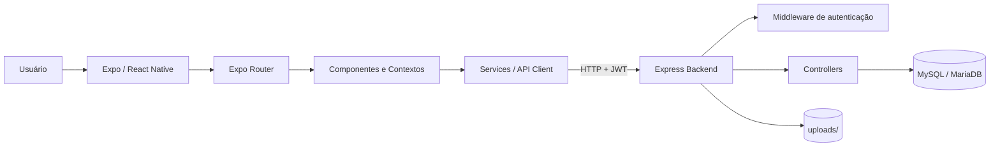
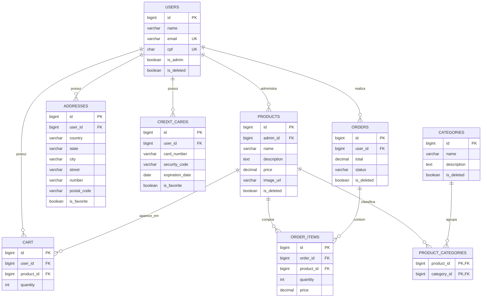
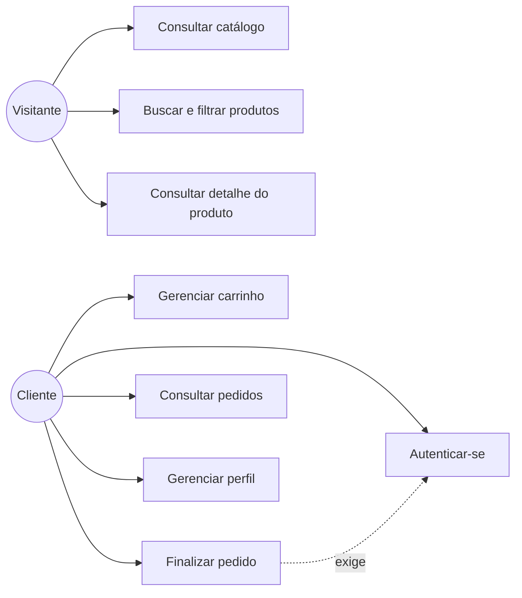
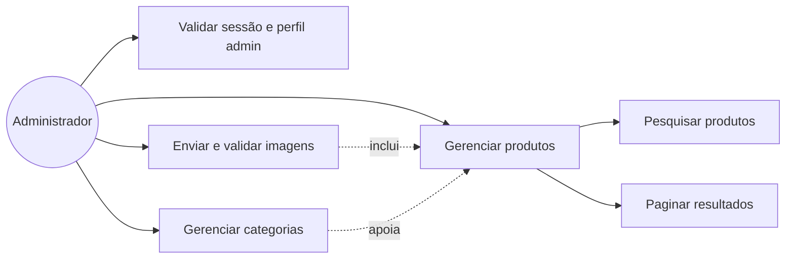
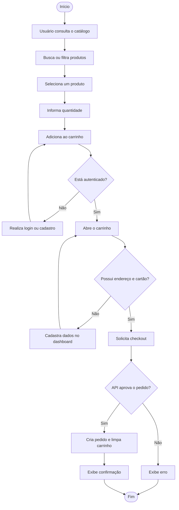
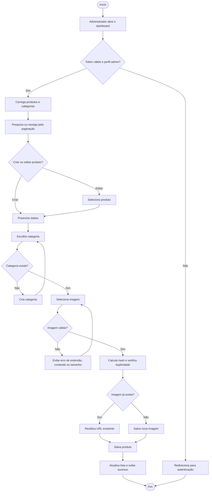
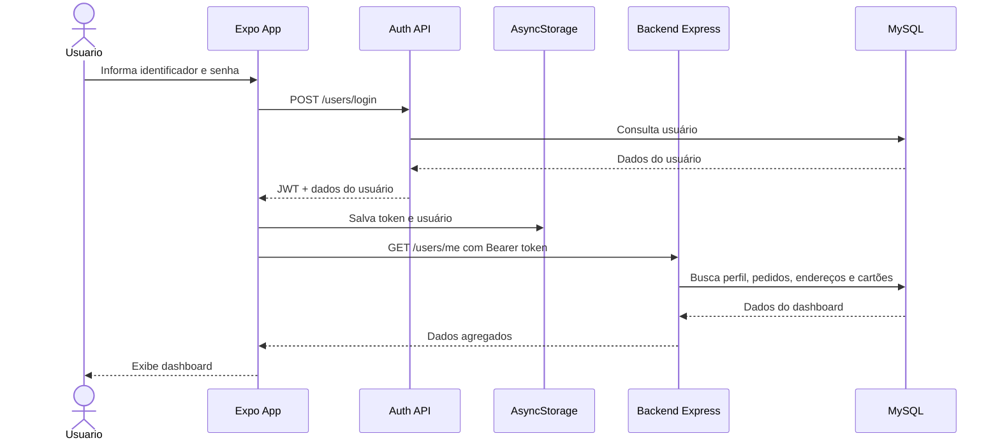
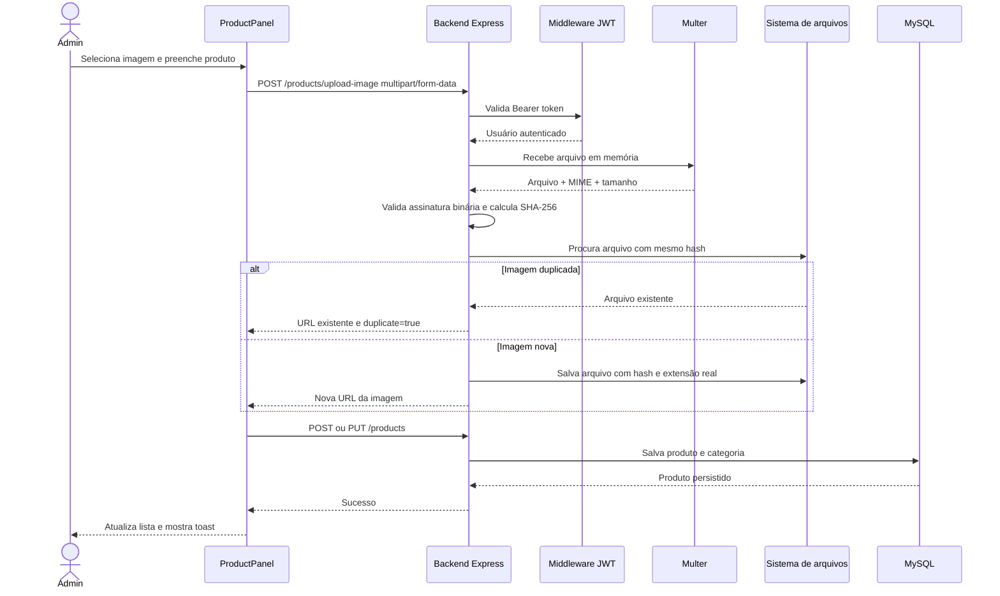

# Documentação do Produto 214K

## 1. Contextualização do problema

O produto 214K é uma plataforma de comércio eletrônico para navegação de produtos, autenticação de usuários, carrinho de compras e finalização de pedidos. A primeira versão do sistema existia como uma aplicação web React com React Router e armazenamento em `localStorage`. Essa versão foi mantida em `backup/` como referência histórica.

A evolução atual migra a experiência para Expo/React Native, mantendo suporte web e acrescentando compatibilidade com Android e iOS. A migração também exigiu a adaptação de:

- Rotas web para rotas baseadas em arquivos com Expo Router.
- Elementos HTML para componentes React Native.
- `localStorage` para AsyncStorage.
- Upload de imagens por URL para seleção de arquivos e armazenamento no backend.
- Menu lateral web para Drawer responsivo.
- Estilos fixos para uma arquitetura global de temas claro/escuro.

O backend ativo fica em `.backend/`, utiliza Express e MySQL/MariaDB, e é consumido pelo aplicativo por meio da API HTTP autenticada com JWT.

## 2. Evolução do produto

### Fase 1: Aplicação web de referência

A aplicação original oferecia:

- Cadastro e login.
- Catálogo e busca por categorias.
- Detalhes de produto.
- Carrinho e checkout.
- Dashboard do usuário.
- Operações administrativas sobre produtos.

### Fase 2: Migração para Expo

A aplicação passou a utilizar:

- Expo SDK 57.
- Expo Router.
- React Native Web.
- AsyncStorage para token e preferências locais.
- Drawer autenticado, exibindo somente as opções permitidas.
- Componentes nativos para formulários, cartões e navegação.

### Fase 3: Funcionalidades administrativas

Foram acrescentados:

- Seleção e criação de categorias.
- Busca de produtos por nome, descrição e categoria.
- Paginação da listagem administrativa.
- Edição e exclusão lógica de produtos.
- Upload de imagens com Multer.
- Validação de tamanho, MIME type e assinatura binária.
- Reutilização de imagens duplicadas por hash SHA-256.

### Fase 4: Padronização visual e acessibilidade de uso

A interface passou a possuir:

- Tema claro e escuro persistido.
- Tokens semânticos de cor.
- Header, footer e Drawer padronizados.
- Componentes de painel, cartões, inputs e botões reutilizáveis.
- Toasts para sucesso e erro em operações relevantes.

## 3. Arquitetura atual

### Camadas

| Camada | Responsabilidade |
|---|---|
| `src/app` | Rotas e composição das telas Expo Router. |
| `src/components` | Componentes visuais reutilizáveis e painéis. |
| `src/context` | Estado global de carrinho e tema. |
| `src/services` | Comunicação com a API, autenticação e operações de domínio. |
| `src/constants` | Tokens de tema, fontes e espaçamentos. |
| `.backend/routes` | Definição dos endpoints HTTP. |
| `.backend/controllers` | Regras de negócio e acesso aos dados. |
| `.backend/middleware` | Autenticação JWT e upload Multer. |
| `.backend/Script.sql` | Modelo relacional do banco. |

## 4. Diagrama Entidade-Relacionamento

## 5. Requisitos funcionais

| Código | Requisito |
|---|---|
| RF01 | O sistema deve permitir o cadastro de usuários com nome, e-mail, senha e CPF. |
| RF02 | O sistema deve permitir login por e-mail ou nome e emitir um token JWT. |
| RF03 | O sistema deve manter a sessão localmente usando AsyncStorage. |
| RF04 | O sistema deve exibir produtos ativos e seus detalhes. |
| RF05 | O sistema deve permitir busca por nome, descrição e categoria. |
| RF06 | O sistema deve permitir filtragem por categoria. |
| RF07 | O usuário autenticado deve poder adicionar, alterar quantidade e remover itens do carrinho. |
| RF08 | O usuário autenticado deve poder finalizar um pedido. |
| RF09 | O sistema deve exigir endereço e forma de pagamento antes do checkout. |
| RF10 | O usuário deve visualizar seu histórico de pedidos. |
| RF11 | O usuário deve poder atualizar seus dados cadastrais e senha. |
| RF12 | O usuário deve poder cadastrar, editar, favoritar e excluir endereços. |
| RF13 | O usuário deve poder cadastrar, favoritar e excluir cartões. |
| RF14 | O administrador deve criar, editar e excluir logicamente produtos. |
| RF15 | O administrador deve selecionar uma categoria existente ou criar uma nova. |
| RF16 | O administrador deve pesquisar e paginar produtos no painel administrativo. |
| RF17 | O sistema deve permitir seleção de imagem no dispositivo ou navegador. |
| RF18 | O backend deve validar imagens e reaproveitar arquivos duplicados. |
| RF19 | O usuário deve alternar entre tema claro e escuro. |
| RF20 | O sistema deve exibir notificações de sucesso e erro nas operações principais. |

## 6. Requisitos não funcionais

| Código | Requisito |
|---|---|
| RNF01 | A aplicação deve funcionar em Android, iOS e Web por meio do Expo. |
| RNF02 | A API deve utilizar JSON e autenticação JWT para recursos protegidos. |
| RNF03 | Senhas não devem ser armazenadas em texto puro; o backend utiliza hash com bcrypt. |
| RNF04 | O CORS deve permitir a comunicação entre o cliente Expo e o backend durante o desenvolvimento. |
| RNF05 | Uploads devem aceitar somente imagens suportadas e limitar o tamanho a 10 MB. |
| RNF06 | Imagens devem ser identificadas pela assinatura binária, não apenas pelo nome do arquivo. |
| RNF07 | Imagens idênticas devem ser reutilizadas por hash SHA-256, evitando duplicação física. |
| RNF08 | Produtos, usuários e demais registros devem possuir exclusão lógica quando aplicável. |
| RNF09 | A interface deve possuir componentes reutilizáveis e tokens de tema centralizados. |
| RNF10 | A preferência de tema deve persistir entre sessões. |
| RNF11 | A aplicação deve informar estados de carregamento, vazio e erro. |
| RNF12 | O código deve manter separação entre telas, componentes, contexto, serviços e backend. |
| RNF13 | A API deve retornar códigos HTTP coerentes e mensagens de erro legíveis. |
| RNF14 | O sistema deve evitar exposição de rotas administrativas para usuários não autenticados. |

## 7. Diagramas de casos de uso

### 7.1 Casos de uso do cliente

### 7.2 Casos de uso administrativo

## 8. Diagramas de atividades

### 8.1 Atividade de compra

### 8.2 Atividade de gestão de produto

## 9. Diagramas de sequência

### 9.1 Login e carregamento do dashboard

### 9.2 Upload de imagem e criação de produto

## 10. Considerações e próximos passos

- Criar testes automatizados específicos para rejeição de GIF, assinatura inválida, tamanho excedido e duplicidade de imagem.
- Adicionar uma tabela de metadados de arquivos, caso o volume de uploads cresça e a varredura do diretório deixe de ser suficiente.
- Aplicar autorização explícita de administrador no middleware de produtos, além da autenticação JWT.
- Separar configurações de desenvolvimento e produção, principalmente URL da API, CORS e armazenamento de imagens.
- Considerar armazenamento de objetos, como S3 ou serviço equivalente, para produção.
- Manter a documentação atualizada a cada mudança de fluxo ou entidade.
